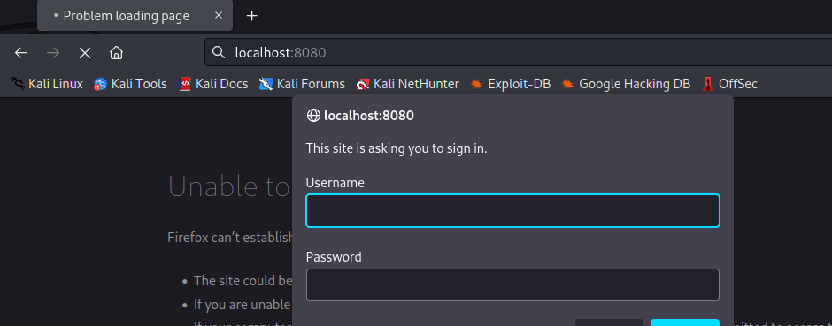

# 写在最前面  

项目是基于netty网络框架来编写的（我拿来学netty），使用socket来保证多协议情况下的反代都可使用。公网服务器端有web界面，用Spring，Mybatis搭建，写的不好，有些页面都是死的，有空再学学Spring再来改了，本来就不会前端，拿gpt写的，但不影响反代功能的使用，clientKey你直接在服务器对应的数据库中配置就行。

你进入对应url取得授权，但你只要不拿来圈元子就直接无视web吧。  

# 效果展示  

我在客户端搭了个靶场，客户端连接之后可以走公网对应的配置端口访问，ssh，mysql访问同理，内网穿透是没问题的。

# 如何打包与使用

#### 客户端  

idea中导出为jar的操作我就不说了，jar文件的操作方式不懂得自己百度吧。需要注意的是客户端对应的jar文件需要与yaml配置文件在同一目录，不然找不到。  

#### 服务端  

客户端的配置相对固定，并且我人很菜，服务端到打包成jar之后里面有的依赖找不到，我处理不来，所以我放弃了这种方法，把所有配置文件都丢到resource目录下了。所以mybatis，spring.datasource.部分需要你自己先改一下相关配置在进行打包放服务器上了。用的maven，所以打包命令

> -mvn clean package

导出为jar包，jar包使用方法略    

顺带说，在IDEA中的运行方式与jar有一定区别，所以配置文件放哪儿与怎么读有一定考究，这里我当懒人直接给的上服务器jar方法，IDEA中的就不给了。

# 后续  

日志处理有一定的问题，后续有空把日志处理做好一点  

项目是多对多的，部署一个服务在公网就可以实现不同用户对不同内网主机的访问，但是要把端口区分开。

后续做个简化版，把web去掉，减少报错率，并且单兵化，就很类似frp了。  

# 致谢  

1.frp

2.github neety项目的众多大佬，很多处理都是参考的大佬们，这里不一一提名了。